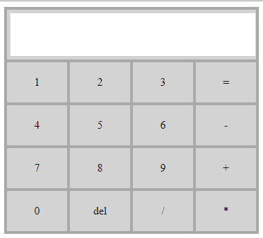

## 1. Calculator Description

Calculator was created by me based on the video tutorial ["Как написать простой калькулятор"](https://www.youtube.com/watch?v=WA3EFIB8-wU&t=203s). The elements of the calculator are arranged in four columns containing 5 cells each. Also added 3 simple functions:

1. A function that allows you to add a number or operator to the input line, corresponding to the number or operator of the button when you click on it. The onclick event is assigned to each element with a number and operators;

2. The substring function with the value (0, exp.length - 1) with the help of which it is possible to display a substring in the input field without the last number, thus realizing the removal of the last character from the input string. The onclick event is assigned to the "del" element;

3. The eval function, which reads the string in the input field and produces a result based on two values, provided that the input field has some data. The onclick event assigned to element "=";

## 2. Appearance

 

