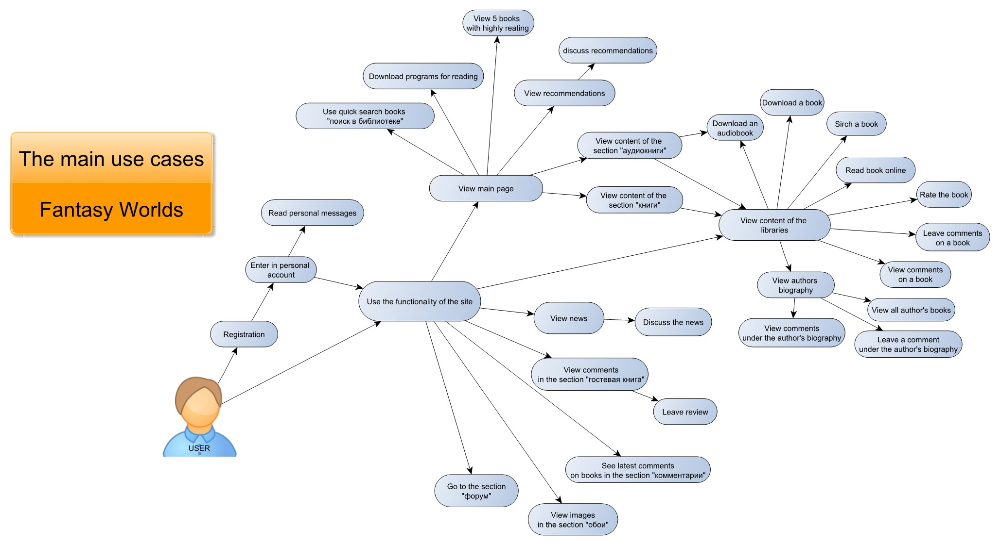

# 1. Fantasy Worlds Requirements

#### Choose a website to your notice and execute functional testing, namely:

1. Study the functionality of the site and create a test plan  as suitable as possible for the implementation of quality assurance activities;

2. A report on the performed functional testing, in an arbitrary form, as suitable as possible for the implementation of quality assurance activities;

3. Several test cases in an arbitrary form, as suitable as possible for the implementation of quality assurance activities;

___
# 2. Results

### 2.1 Test Plan

[Test Plan](https://github.com/LizaDoroshchenko/CV/blob/main/fantasy-worlds/TestPlan.pdf)

### 2.2 Use Cases

[Use Cases](https://github.com/LizaDoroshchenko/CV/blob/main/fantasy-worlds/UseCases.pdf)

### 2.3  Test Cases 

[Test Case 1](https://github.com/LizaDoroshchenko/CV/blob/main/fantasy-worlds/TestCase1.jpg)
[Test Case 2](https://github.com/LizaDoroshchenko/CV/blob/main/fantasy-worlds/TestCase2.pdf)
[Test Case 3](https://github.com/LizaDoroshchenko/CV/blob/main/fantasy-worlds/TestCase3.pdf)

### 2.4 Bug Reports

[Bug Reports](https://github.com/LizaDoroshchenko/CV/blob/main/fantasy-worlds/BugReport.jpg)

