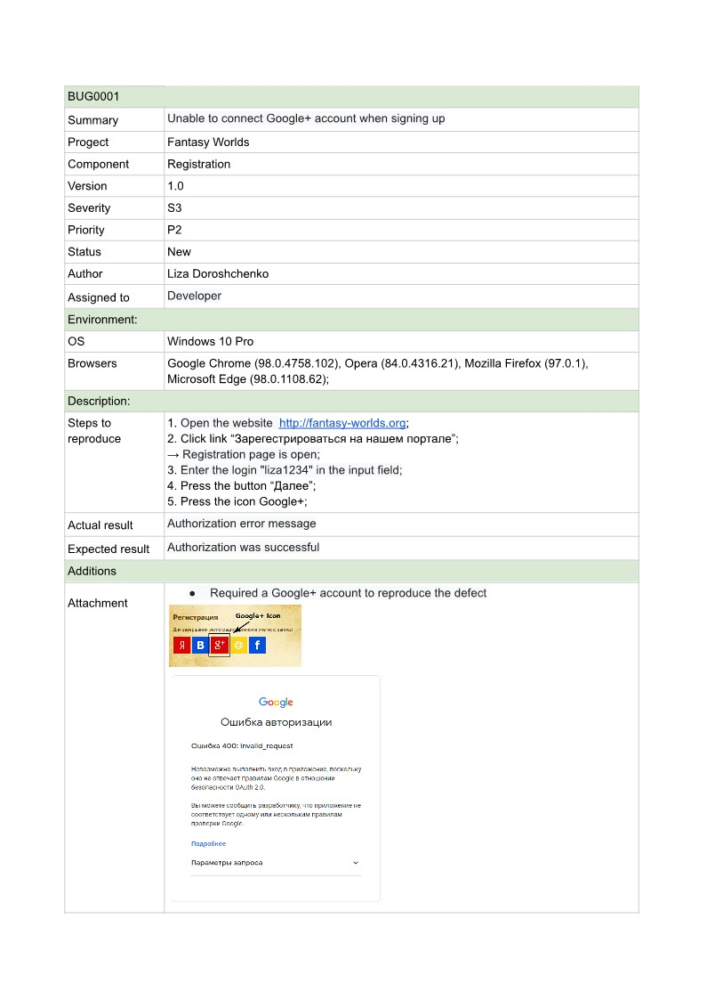

# 1. Fantasy Worlds Requirements

#### Choose a website to your notice and execute functional testing, namely:

1. Study the functionality of the site and create a test plan  as suitable as possible for the implementation of quality assurance activities;

2. A report on the performed functional testing, in an arbitrary form, as suitable as possible for the implementation of quality assurance activities;

3. Several test cases in an arbitrary form, as suitable as possible for the implementation of quality assurance activities;

___
# 2. Results

### 2.1 Use Cases

### 2.2  Test Cases example

Test Case 1

### 2.3 Bug Report example

Bug Report 1

