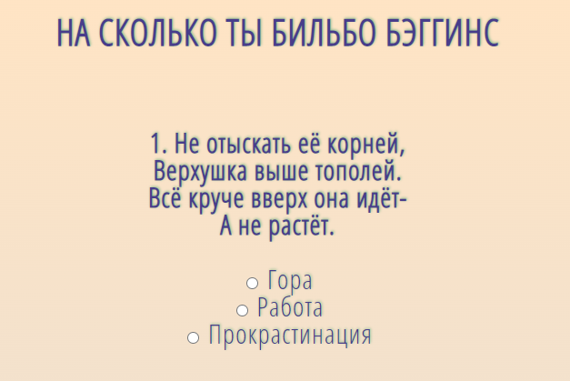
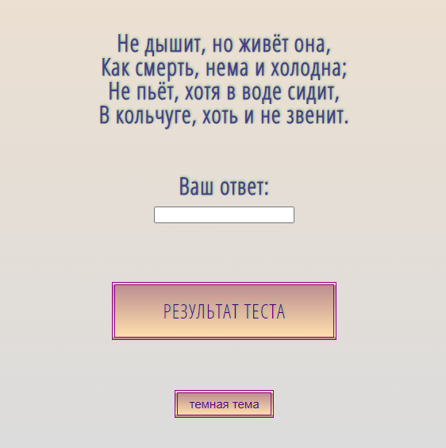
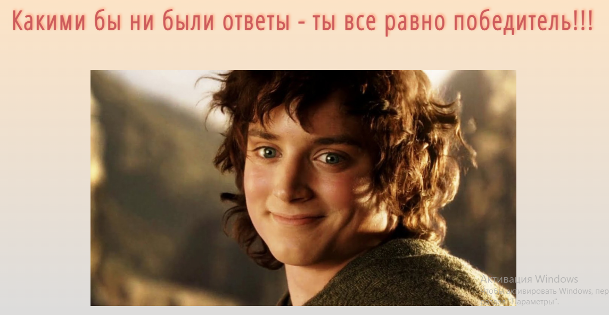

## 1. Test Hobbit 

### 1.1 Description

[Test Hobbit](https://github.com/LizaDoroshchenlo123Ll/CV/tree/main/test-hobbit) - is a small site with the ability to find out "How Bilbo Baggins Are You". The site consists of two pages, where the first page is designed as a test with riddles from the book "The Hobbit, or There and Back Again" and the ability to select and enter answers (using radio buttons and an input field), and there is also a link to the second page (designed as a "РЕЗУЛЬТАТ ТЕСТА" button) and a "темная тема" button that allows you to change the color of the background and text of the page. By clicking on the link "РЕЗУЛЬТАТ ТЕСТА" you can view the result of passing the test and the attached image.

### 1.2 Pages appearance

Page 1:

Page 2:

